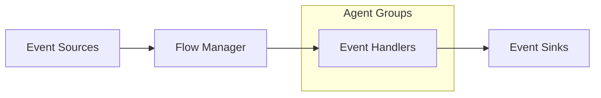

# Fluxtion Server

Fluxtion Server is a high-performance, event-driven server framework designed for building scalable and configurable
event processing applications.

## Overview

Fluxtion Server provides a robust architecture for handling event-driven applications with features including:

- Event processing pipelines
- Service management
- Concurrent execution through agents
- Configurable event routing
- Dynamic component management

This architecture provides a flexible and scalable approach to event processing, allowing for efficient handling of
events from multiple sources through configurable processing pipelines to various sinks.

## Features

- **High Performance**: Optimized for high-throughput event processing
- **Flexibility**: Dynamic addition/removal of components
- **Configurability**: YAML-based configuration
- **Error Handling**: Built-in error management and logging
- **Scheduling**: Deadline-based task scheduling
- **Modularity**: Service-oriented architecture

### Key Features

1. **Group-Based Processing**
   - Handlers are organized into named groups
   - Each group operates independently
   - Allows for logical separation of concerns

2. **Configuration Control**
   - Log levels can be set per group or handler
   - Idle strategies are configurable
   - Supports runtime configuration updates

3. **Performance Optimization**
   - Agent-based concurrent execution
   - Configurable idle strategies
   - Group-based threading model

4. **Dynamic Management**
   - Handlers can be added/removed at runtime
   - Support for hot configuration updates
   - Dynamic service registration


## Event Processing Architecture



## Core Components

### Event Processing

- **Event Sources**: Producers that generate events
- **Event Processors**: Custom handlers for processing specific event types
- **Event Sinks**: Consumers that receive processed events
- **Event Flow Manager**: Coordinates event routing and processing

### Services

- Dynamic service registration and management
- Support for both standard and agent-based services
- Runtime control (start/stop) of services
- Service dependency management
- Registered at the container level for lookup and use by event handlers

### Agent Hosted Application Logic

- Background workers for continuous processing
- Configurable idle strategies
- Concurrent execution support
- Deadline-based scheduling

## Components and Interaction Flow

1. **Event Sources (Feeds)**
    - Generate events into the system
    - Can run as standalone services or agents
    - Examples might include:
        - Market data feeds
        - Sensor inputs
        - External system integrations

2. **Event Handlers**
    - Organized into named groups
    - Each group runs with its own:
        - Idle strategy for performance optimization
        - Log level configuration
        - Independent thread of execution

    - Features:
        - Can be dynamically added/removed
        - Support configuration injection
        - Include audit logging capabilities
        - Receives callback when an event feed publishes and event
        - Can look up and use services registered in the container
        - Can publish output to event sinks

3. **Event Sinks**
    - Receive processed events
    - Can operate as services or agents
    - Handle output distribution
    - Examples include:
        - Database writers
        - Network publishers
        - Monitoring systems

4. **Flow Manager**
    - Central coordination component
    - Routes events from sources to appropriate handlers
    - Manages event dispatch strategies
    - Handles event mapping and distribution

## Configuration

Fluxtion Server uses YAML configuration files for setup. Configure using the system property:
java -Dfluxtionserver.config.file=path/to/config.yaml

```yaml
eventFeeds:
  - name: marketDataFeed
    agent: true
    # source configuration

eventHandlers:
  - agentName: processingGroup1
    logLevel: INFO
    idleStrategy: BUSY_SPIN
    eventHandlers:
    handler1:
    # handler specific config
    handler2:
    # handler specific config

eventSinks:
  - name: databaseWriter
    agent: true
    # sink configuration
```

## Server Lifecycle

1. **Boot**: Server initialization with configuration
2. **Registration**: Services and event processors registration
3. **Initialization**: Component initialization
4. **Start**: Service and processor activation
5. **Runtime**: Event processing and service execution
6. **Management**: Dynamic control of components

### Lifecycle Management

1. **Initialization Phase**
    - Sources register with Flow Manager
    - Handler groups are created
    - Configuration is applied

2. **Runtime Phase**
    - Events flow from sources through handlers
    - Handlers process events based on configuration
    - Processed events are sent to sinks

3. **Management Phase**
    - Monitoring of handler performance
    - Dynamic updates to configuration
    - Addition or removal of handlers


## Usage

### Starting the Server

Boot with configuration file

```java
FluxtionServer server = FluxtionServer.bootServer(logRecordListener);
```

Or boot with custom configuration

```java
FluxtionServer server = FluxtionServer.bootServer(appConfig, logRecordListener);
```

