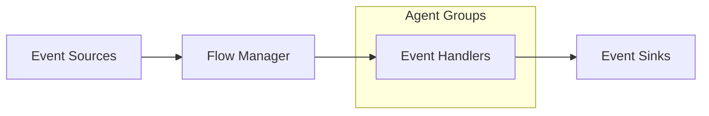
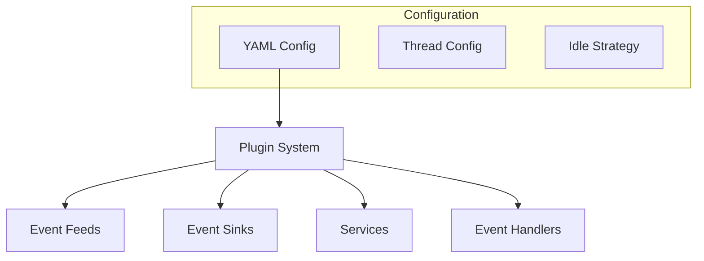

# Fluxtion Server

Fluxtion Server is a high-performance, event-driven server framework designed for building scalable and configurable
event processing applications.

## Overview

Fluxtion Server provides a robust architecture for handling event-driven applications with features including:

- Event processing pipelines
- Service management
- Concurrent execution through agents
- Configurable event routing
- Dynamic component management

This architecture provides a flexible and scalable approach to event processing, allowing for efficient handling of
events from multiple sources through configurable processing pipelines to various sinks.

## Features

- **High Performance**: Optimized for high-throughput event processing
- **Flexibility**: Dynamic addition/removal of components
- **Configurability**: YAML-based configuration
- **Error Handling**: Built-in error management and logging
- **Scheduling**: Deadline-based task scheduling
- **Modularity**: Service-oriented plugin-based architecture

### Key Features

1. **Group-Based Processing**
    - Handlers are organized into named groups
    - Each group operates independently
    - Allows for logical separation of concerns

2. **Configuration Control**
    - Log levels can be set per group or handler
    - Idle strategies are configurable
    - Supports runtime configuration updates

3. **Performance Optimization**
    - Agent-based concurrent execution
    - Configurable idle strategies
    - Group-based threading model

4. **Dynamic Management**
    - Handlers can be added/removed at runtime
    - Support for hot configuration updates
    - Dynamic service registration

## Event Processing Architecture



## Core Components

### Event Processing

- **Event Sources**: Producers that generate events
- **Event Processors**: Custom handlers for processing specific event types
- **Event Sinks**: Consumers that receive processed events
- **Event Flow Manager**: Coordinates event routing and processing

### Services

- Dynamic service registration and management
- Support for both standard and agent-based services
- Runtime control (start/stop) of services
- Service dependency management
- Registered at the container level for lookup and use by event handlers

### Agent Hosted Application Logic

- Background workers for continuous processing
- Configurable idle strategies
- Concurrent execution support
- Deadline-based scheduling

## Components and Interaction Flow

1. **Event Sources (Feeds)**
    - Generate events into the system
    - Can run as standalone services or agents
    - Examples might include:
        - Market data feeds
        - Sensor inputs
        - External system integrations

2. **Event Handlers**
    - Organized into named groups
    - Each group runs with its own:
        - Idle strategy for performance optimization
        - Log level configuration
        - Independent thread of execution

    - Features:
        - Can be dynamically added/removed
        - Support configuration injection
        - Include audit logging capabilities
        - Receives callback when an event feed publishes and event
        - Can look up and use services registered in the container
        - Can publish output to event sinks

3. **Event Sinks**
    - Receive processed events
    - Can operate as services or agents
    - Handle output distribution
    - Examples include:
        - Database writers
        - Network publishers
        - Monitoring systems

4. **Flow Manager**
    - Central coordination component
    - Routes events from sources to appropriate handlers
    - Manages event dispatch strategies
    - Handles event mapping and distribution

## Configuration

Fluxtion Server uses YAML configuration files for setup. Configure using the system property:

```shell
java -Dfluxtionserver.config.file=path/to/config.yaml
```
Sample yaml 
```yaml
# --------- EVENT INPUT FEEDS BEGIN CONFIG ---------
eventFeeds:
  - instance: !!com.fluxtion.server.dispatch.HeartBeatEventFeed { }
    name: heartBeater
    agentName: heartBeatPublisher-thread
    broadcast: true
# --------- EVENT INPUT FEEDS END CONFIG ---------

# --------- EVENT HANDLERS BEGIN CONFIG ---------
eventHandlers:
  - agentName: heartBeatProcessor-thread
    eventHandlers:
       # handler specific config
        heartBeatProcessor_1:
        eventHandler: !!com.fluxtion.server.dispatch.HeartBeatExampleProcessor {
        logLevel: DEBUG
      # handler specific config
        heartBeatProcessor_2:
        eventHandler: !!com.fluxtion.server.dispatch.HeartBeatExampleProcessor {
        logLevel: DEBUG
# --------- EVENT HANDLERS END CONFIG ---------
        
# --------- AGENT THREAD BEGIN CONFIG ---------
agentThreads:
  - agentName: heartBeatPublisher-thread
    idleStrategy: !!com.fluxtion.agrona.concurrent.BusySpinIdleStrategy { }
  - agentName: heartBeatProcessor-thread
    idleStrategy: !!com.fluxtion.agrona.concurrent.BusySpinIdleStrategy { }
# --------- AGENT THREAD END CONFIG ---------
```

To run the sample app execute [MultiEvenProcessor](src/test/java/com/fluxtion/server/dispatch/HeartBeatEventFeed.java)

The server tries to publish just over 1 million messages per second from the [HeartBeatEventFeed](src/test/java/com/fluxtion/server/dispatch/HeartBeatEventFeed.java)
to two separate event handlers, [HeartBeatExampleProcessor](src/test/java/com/fluxtion/server/dispatch/HeartBeatExampleProcessor.java),
each receiving callbacks on their own thread.

## Plugin-Based Architecture

Fluxtion Server implements a flexible plugin-based architecture that allows for easy extension of all major components.
This design enables developers to create custom implementations while maintaining consistency and reliability.

### Component Types



### 1. Event Feeds

- **Purpose**: Source of events into the system
- **Extension Points**:
    - Custom data source integration
    - Protocol implementations
    - Input format handlers
    - Data transformation
  
### 2. Event Sinks

- **Purpose**: Output handlers for processed events
- **Extension Points**:
    - Custom output formats
    - External system integration
    - Data transformation

### 3. Services
- **Purpose**: Provide business logic and functionality
- **Extension Points**:
   - Custom business logic
   - Integration services
   - Utility services

### 4. Event Handlers
- **Purpose**: Process and transform events
- **Extension Points**:
   - Custom event processing logic
   - Event transformation
   - Business rules implementation

### Idle Strategies
- BUSY_SPIN
- YIELDING
- SLEEPING
- CUSTOM

## Plugin Lifecycle

1. **Registration**
   - Plugins are registered through configuration
   - Dynamic loading at runtime
   - Validation of plugin configuration

2. **Initialization**
   - Configuration injection
   - Resource allocation
   - Connection establishment

3. **Execution**
   - Plugin execution in configured thread context
   - Event processing
   - Service provision

4. **Shutdown**
   - Resource cleanup
   - Connection termination
   - State persistence

## Best Practices

1. **Plugin Development**
   - Implement necessary interfaces
   - Follow thread-safety guidelines
   - Handle errors appropriately
   - Document configuration requirements

2. **Configuration Management**
   - Use clear naming conventions
   - Document plugin configurations
   - Version plugin implementations
   - Test configurations before deployment

3. **Performance Considerations**
   - Choose appropriate idle strategies
   - Monitor plugin performance
   - Optimize resource usage

4. **Error Handling**
   - Implement proper error handling
   - Provide meaningful error messages
   - Consider fallback strategies
   - Log relevant information

## Testing Plugins

1. **Unit Testing**
   - Test plugin logic
   - Verify configuration handling
   - Check error scenarios

2. **Integration Testing**
   - Test plugin interaction
   - Verify event flow
   - Check resource management

3. **Performance Testing**
   - Measure throughput
   - Check resource usage
   - Verify scaling capabilities

This plugin architecture provides a flexible and extensible system for adding new functionality to Fluxtion Server 
while maintaining consistency and reliability across all components.

## Server Lifecycle

1. **Boot**: Server initialization with configuration
2. **Registration**: Services and event processors registration
3. **Initialization**: Component initialization
4. **Start**: Service and processor activation
5. **Runtime**: Event processing and service execution
6. **Management**: Dynamic control of components

### Lifecycle Management

1. **Initialization Phase**
    - Sources register with Flow Manager
    - Handler groups are created
    - Configuration is applied

2. **Runtime Phase**
    - Events flow from sources through handlers
    - Handlers process events based on configuration
    - Processed events are sent to sinks

3. **Management Phase**
    - Monitoring of handler performance
    - Dynamic updates to configuration
    - Addition or removal of handlers

## Usage

### Starting the Server

Boot with configuration file

```java
FluxtionServer server = FluxtionServer.bootServer(logRecordListener);
```

Or boot with custom configuration

```java
FluxtionServer server = FluxtionServer.bootServer(appConfig, logRecordListener);
```

