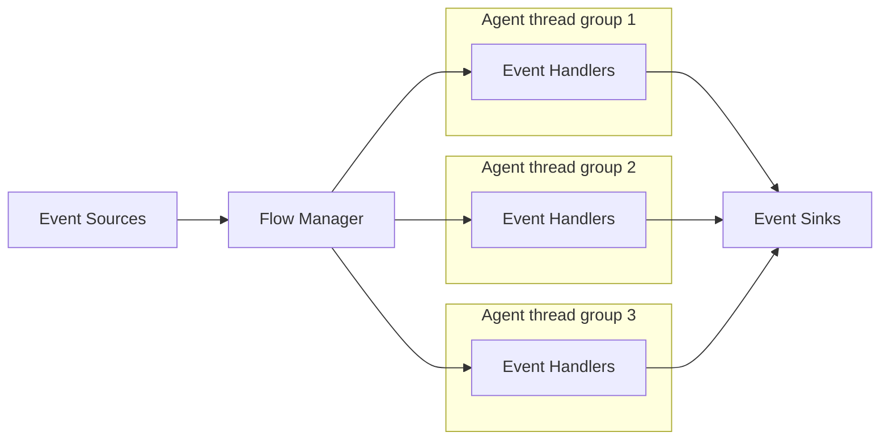
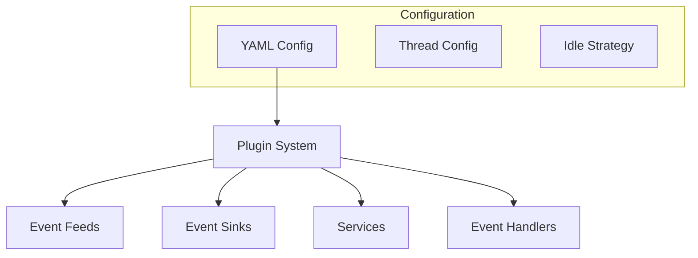

# Fluxtion Server: Concepts, Architecture, and Usage

This document provides a deeper overview of Fluxtion Server beyond the short README summary. It covers the event-driven
architecture, core components, configuration, plugin model, lifecycle, and example usage.

## Event Processing Architecture



## Core Components

### Event Processing

- Event Sources: Producers that generate events
- Event Processors: Custom handlers for processing specific event types
- Event Sinks: Consumers that receive processed events
- Event Flow Manager: Coordinates event routing and processing

### Services

- Dynamic service registration and management
- Support for both standard and agent-based services
- Runtime control (start/stop) of services
- Service dependency management
- Registered at the container level for lookup and use by event handlers

### Agent Hosted Application Logic

- Background workers for continuous processing
- Configurable idle strategies
- Concurrent execution support
- Deadline-based scheduling

## Components and Interaction Flow

1. Event Sources (Feeds)
    - Generate events into the system
    - Can run as standard services or agents
    - Examples: market data feeds, sensors, external integrations

2. Event Handlers
    - Organized into named groups, each with its own thread/idle strategy/log level
    - Features: dynamic add/remove, configuration injection, audit logging
    - Receive callbacks when feeds publish events; can use registered services; can publish to sinks

3. Event Sinks
    - Receive processed events and handle output distribution (DB, network, monitoring)
    - Can operate as services or agents

4. Flow Manager
    - Central coordination component routing events and managing dispatch strategies

## Configuration (YAML)

You can configure Fluxtion Server with YAML (or programmatically). Example snippet:

```yaml
# --------- EVENT INPUT FEEDS BEGIN CONFIG ---------
eventFeeds:
  - instance: !!com.fluxtion.server.example.HeartBeatEventFeed { }
    name: heartBeater
    agentName: heartBeatPublisher-thread
    broadcast: true
# --------- EVENT INPUT FEEDS END CONFIG ---------

# --------- EVENT HANDLERS BEGIN CONFIG ---------
eventHandlers:
  - agentName: heartBeatProcessor-thread
    eventHandlers:
      heartBeatProcessor_1:
        eventHandler: !!com.fluxtion.server.example.HeartBeatExampleProcessor { }
        logLevel: DEBUG
      heartBeatProcessor_2:
        eventHandler: !!com.fluxtion.server.example.HeartBeatExampleProcessor { }
        logLevel: DEBUG
        # --------- EVENT HANDLERS END CONFIG ---------

# --------- AGENT THREAD BEGIN CONFIG ---------
agentThreads:
  - agentName: heartBeatPublisher-thread
    idleStrategy: !!com.fluxtion.agrona.concurrent.BusySpinIdleStrategy { }
  - agentName: heartBeatProcessor-thread
    idleStrategy: !!com.fluxtion.agrona.concurrent.BusySpinIdleStrategy { }
# --------- AGENT THREAD END CONFIG ---------
```

## Plugin-Based Architecture

Fluxtion Server implements a flexible plugin-based architecture across major components.

### Component Types



- Feeds: integrations/protocols/input formats/transforms
- Sinks: output formats/external integrations/transforms
- Services: business logic, integration, utilities
- Event Handlers: processing, transformation, business rules

### Idle Strategies

- Busy spin, yielding, sleeping, or custom

## Plugin Lifecycle

1. Registration: via configuration; dynamic loading; validation
2. Initialization: configuration injection; resources; connections
3. Execution: run in configured thread context; event processing; service provision
4. Shutdown: cleanup; connection termination; persistence

## Best Practices

- Implement required interfaces and follow thread-safety guidelines
- Clear configuration and versioning; test configurations before deployment
- Choose appropriate idle strategies; monitor performance; optimize resources
- Robust error handling and meaningful logging

## Server Lifecycle

1. Boot: Server initialization with configuration
2. Registration: Services and event processors
3. Initialization: Component initialization
4. Start: Activation of services and processors
5. Runtime: Event processing and service execution
6. Management: Dynamic control of components

## See Also

- [Architecture index](../architecture/index.md)
- [Architecture overview](../architecture/overview.md)
- [Components](../architecture/components.md)
- [Event flow](../architecture/event-flow.md)
- [Sequence diagrams](../architecture/sequence-diagrams/index.md)
- [Coding standards](../standards/coding-standards.md)