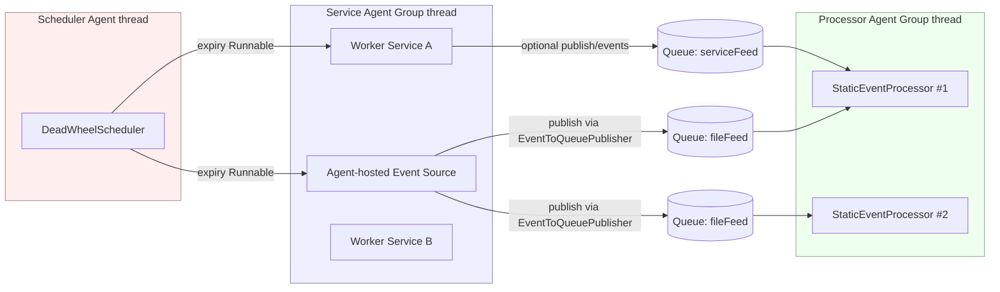
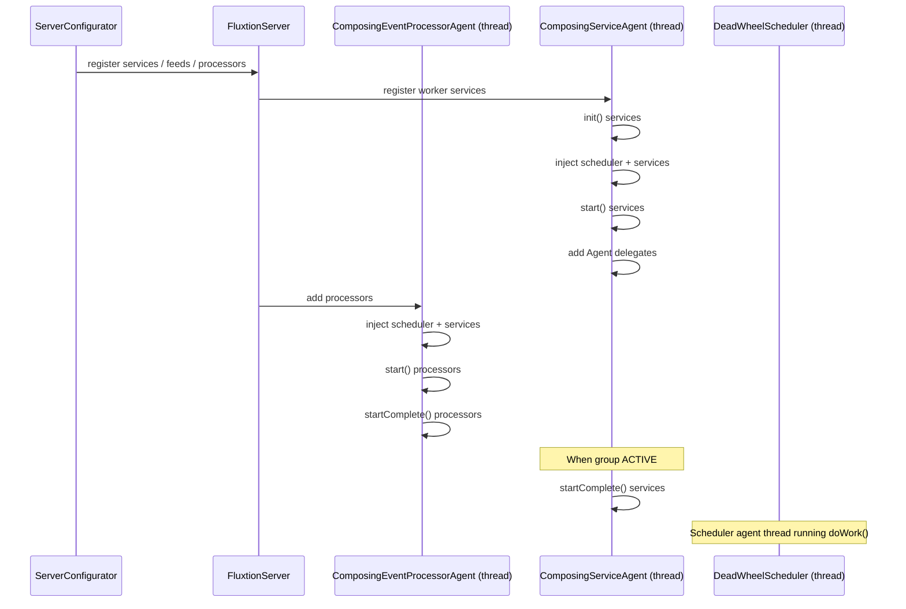
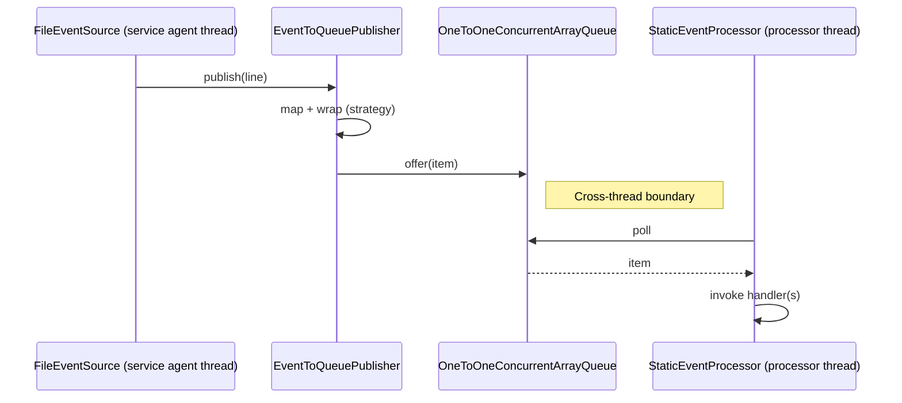

# Guide: Fluxtion Server Threading Model

This guide explains how Fluxtion Server uses threads to run your event processors, services, event sources, and the
built‑in scheduler. It focuses on where your code executes, how agents communicate, and how to design components that
are correct and performant under the single‑threaded processor model.

You’ll learn:

- Agent groups and their threads (processor groups, worker/service groups, scheduler)
- Single‑thread rule for processors and why it matters
- How event sources publish to processors (queues and wrapping)
- Lifecycle timing (init → start → startComplete → stop → tearDown)
- Where callbacks execute (processor thread vs service thread vs scheduler thread)
- How to safely hand work across threads (EventToQueuePublisher, ScheduledTriggerNode)

References in this repository:

- Processor
  agent: [ComposingEventProcessorAgent](../../src/main/java/com/fluxtion/server/dutycycle/ComposingEventProcessorAgent.java)
- Service agent: [ComposingServiceAgent](../../src/main/java/com/fluxtion/server/dutycycle/ComposingServiceAgent.java)
- Scheduler
  agent: [DeadWheelScheduler](../../src/main/java/com/fluxtion/server/service/scheduler/DeadWheelScheduler.java)
- Event source
  base: [AbstractEventSourceService](../../src/main/java/com/fluxtion/server/service/extension/AbstractEventSourceService.java) (+
  agent variant)
- Queue publisher: [EventToQueuePublisher](../../src/main/java/com/fluxtion/server/dispatch/EventToQueuePublisher.java)

## 1) Big picture

Fluxtion Server composes several “agents,” each typically running on its own thread:

- One or more Processor Agent Groups (each contains one or more StaticEventProcessor instances)
- One or more Service Agent Groups (each hosts zero or more worker services)
- One Scheduler Agent (the deadline wheel)
- Optional Agent‑hosted event sources (e.g., FileEventSource)

Data is handed between agents through lock‑free single‑producer/single‑consumer queues managed by EventFlowManager and
EventToQueuePublisher. Each processor runs single‑threaded on its agent thread — your processor code is not concurrently
executed by multiple threads.

### Component/Thread overview



Notes:

- Each Agent Group is a thread that can host multiple components.
- Event publication crosses threads via queues. The publisher thread enqueues, the subscriber processor dequeues on its
  own thread.
- Scheduler expiry actions run on the scheduler agent thread; to affect a processor, schedule a trigger that publishes
  into the processor or use `ScheduledTriggerNode`.

## 2) Lifecycle and when things start

All lifecycle participants (event sources, processors, services) follow this sequence:

1) `init()` — light setup
2) `start()` — allocate resources; event sources may enable pre‑start caching
3) `startComplete()` — system is ready; sources replay caches and switch to publishing
4) `stop()` — stop work, flush/close resources
5) `tearDown()` — final cleanup

Processor and service agents add their components and then call `startComplete()` once the group is active.

### Startup sequence (high level)



## 3) Event dispatch path

Agent‑hosted event sources (e.g., `FileEventSource`) typically publish on their own thread. The data is mapped/wrapped
by `EventToQueuePublisher` and offered to one or more target queues. Processors consume from those queues on their own
agent thread.



Key details:

- `EventWrapStrategy` controls whether items are wrapped in `NamedFeedEvent` or sent raw.
- If `cacheEventLog` is enabled in the publisher, events are recorded and replayed on `startComplete()`.
- `EventToQueuePublisher` bounds spin when queues are contended to avoid blocking publishers; slow consumers are warned.

## 4) Where does my code run?

- Processor event handlers (e.g., `ObjectEventHandlerNode#handleEvent`) run on the Processor Agent Group thread.
- Agent‑hosted services and agent‑hosted event sources run their `doWork()` on the Service Agent Group thread that hosts
  them.
- Scheduler expiry actions run on the Scheduler Agent thread.
- Admin commands registered within a processor context are delivered into that processor’s queue and executed on its
  thread; otherwise they execute on the caller thread.

Implications:

- Inside a processor, your state is single‑threaded — no external synchronization is required for state mutated only by
  that processor.
- To update a processor from another thread (service, scheduler), publish an event into the processor’s queue. Don’t
  directly mutate processor state from other threads.

## 5) Moving work between threads safely

Common patterns to marshal work back into a processor context:

- Event publication from services/sources using `EventToQueuePublisher` (via an `EventSource` or an admin command routed
  to a processor queue).
- Use `ScheduledTriggerNode` to schedule a new event cycle into the processor after a delay; the trigger causes
  `fireNewEventCycle()` to run on the processor thread.

Example using `ScheduledTriggerNode`:

```java
public class MySchedulerAwareHandler extends com.fluxtion.runtime.node.ObjectEventHandlerNode {
    private final com.fluxtion.server.service.scheduler.ScheduledTriggerNode trigger =
            new com.fluxtion.server.service.scheduler.ScheduledTriggerNode();

    // After wiring, call this from handleEvent or during start
    void scheduleTick(long millis) {
        trigger.triggerAfterDelay(millis); // later causes a new event cycle on this processor thread
    }
}
```

## 6) Best practices

- Keep `Agent#doWork()` non‑blocking; do small chunks and return 0 when idle.
- Don’t call blocking IO from processor event handlers; offload to a worker service and publish results back.
- For periodic tasks, prefer the scheduler (rescheduling pattern) over sleeping in `doWork()`.
- Guard verbose logging in hot paths with `log.isLoggable(...)` or cached flags.
- If you need pre‑start replay, enable publisher caching in your source’s `start()` and call `dispatchCachedEventLog()`
  on `startComplete()`.
- Use meaningful agent group names and idle strategies in `AppConfig` for observability and performance tuning.

## 7) Glossary of threads

- Processor Agent Group thread: runs one or more `StaticEventProcessor` instances (single‑threaded event handling).
- Service Agent Group thread: runs worker services and agent‑hosted event sources (`Agent#doWork`).
- Scheduler Agent thread: runs `DeadWheelScheduler` and executes expiry `Runnable`s.

## 8) Related docs

- Using the scheduler service: [using-the-scheduler-service](using-the-scheduler-service.md)
- Writing an event source plugin: [writing-an-event-source-plugin](writing-an-event-source-plugin.md)
- Writing a service plugin: [writing-a-service-plugin](writing-a-service-plugin.md)
- Writing an admin command: [writing-an-admin-command](writing-an-admin-command.md)
- Architecture + sequence diagrams: [architecture](../architecture/index.md)

## 9) Optional: Core pinning for agent threads

Fluxtion Server supports best-effort CPU core pinning for agent threads. This can help reduce context switches and improve tail latency on systems where CPU affinity is desirable.

Key points:
- Configure per-agent core pinning using AppConfig’s agent Threads: [ThreadConfig](../../src/main/java/com/fluxtion/server/config/ThreadConfig.java) has an optional coreId field (zero-based CPU index).
- Pinning is applied inside the agent thread itself during start (onStart) for both processor and service agent groups:
  - Processor agent: [ComposingEventProcessorAgent](../../src/main/java/com/fluxtion/server/dutycycle/ComposingEventProcessorAgent.java)
  - Service agent: [ComposingServiceAgent](../../src/main/java/com/fluxtion/server/dutycycle/ComposingServiceAgent.java)
- Fluxtion uses a lightweight helper [CoreAffinity](../../src/main/java/com/fluxtion/server/internal/CoreAffinity.java) that attempts to pin via reflection to OpenHFT’s Affinity library if present; otherwise it logs and no-ops.

Configure via fluent builder:
```java
import com.fluxtion.server.config.AppConfig;
import com.fluxtion.server.config.ThreadConfig;
import com.fluxtion.agrona.concurrent.BusySpinIdleStrategy;

AppConfig appConfig = AppConfig.builder()
    // Configure processor agent group thread
    .addThread(ThreadConfig.builder()
        .agentName("processor-agent")
        .idleStrategy(new BusySpinIdleStrategy())
        .coreId(0) // pin to CPU core 0 (zero-based index)
        .build())
    // Configure service agent group thread
    .addThread(ThreadConfig.builder()
        .agentName("service-agent")
        .coreId(2) // pin to CPU core 2
        .build())
    // ... add groups/feeds/services as usual
    .build();
```

Runtime behavior:
- When an agent group thread starts, the server resolves the configured core for that agent via FluxtionServer.resolveCoreIdForAgentName and calls CoreAffinity.pinCurrentThreadToCore(coreId). If no coreId is configured, nothing is done.
- If OpenHFT’s Affinity is not on the classpath, pinning is skipped with an info log.

Optional dependency for pinning:
- To enable actual OS-level pinning, add the test/runtime dependency on OpenHFT Affinity in your project.
  See this repository’s POM for an example test-scoped optional dependency: [pom.xml](../../pom.xml) (artifact net.openhft:affinity).
- A simple optional test that exercises pinning via reflection is provided here: [CoreAffinityOptionalTest](../../src/test/java/com/fluxtion/server/internal/CoreAffinityOptionalTest.java).

Notes:
- Core IDs are zero-based and depend on your OS/CPU topology.
- Pinning can improve determinism but may reduce OS scheduling flexibility; benchmark your workload.
