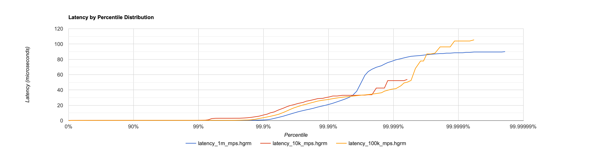
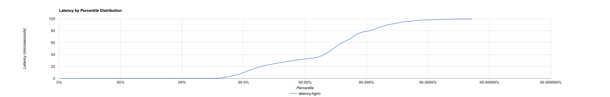
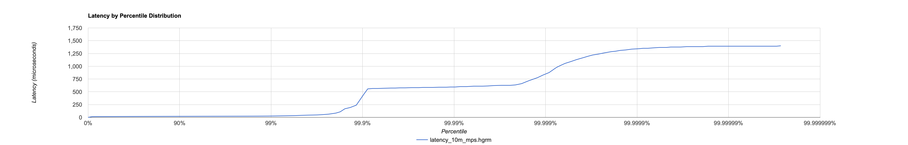

# Fluxtion Server Benchmarks and Performance

This page summarizes benchmark results and observations for the Fluxtion Server using the object pool and in-VM event flow.

Source of results:
- Data files: `*.hgrm` under this directory were produced by running the test/benchmark `BenchmarkObjectPoolDistribution` in report mode.
- Visualizations: Histogram PNGs in this folder were generated from those HdrHistogram output files.

## Test setup at a glance
- Event flow: In-VM EventSource -> server event pipeline -> handler.
- Object pooling: Messages are acquired from the global ObjectPoolsRegistry, enabling zero per-operation allocations in steady state.
- Batching: The server supports batching in parts of the pipeline for throughput; this impacts latency distribution (see below).
- Threading: Busy spin agents with best-effort core pinning where available.
- Machine: Apple Mac (laptop/desktop class). Note: macOS typically lacks strict CPU isolation/affinity controls compared to some Linux setups.

## Headline results
- Throughput: The server sustains approximately 10 million messages per second (10 M mps) in steady state in this setup.
- Latency characteristics: As batching is enabled to drive throughput, the average and tail latencies increase. This is visible as a right-shift and heavier tail in the latency histograms and percentile distributions.
- Jitter: Because the measurements were taken on a Mac that does not support hard CPU isolation, OS jitter and background activity are visible in the higher percentiles (e.g., p99, p99.9), as occasional spikes.

## Files in this directory
- HdrHistogram raw distributions (nanoseconds):
  - `latency_10k_mps.hgrm`
  - `latency_100k_mps.hgrm`
  - `latency_1m_mps.hgrm`
  - `latency_10m_mps.hgrm`
- Charts derived from the above:
  - `Histogram_1k_10k_1M_mps.png`
  - `Histogram_1m_mps.png`
  - `Histogram_10m_mps.png`

You can open the `.hgrm` files with HdrHistogram tooling or any text editor to inspect percentile distributions.

## Throughput vs. latency: what to expect
- At lower message rates (e.g., 10k–100k mps), per-event latency is typically lower and the distribution tighter.
- At 1M mps, latency begins to climb, but percentiles remain reasonably tight on a quiet system.
- At 10M mps, the pipeline efficiency improves thanks to batching, but individual event latency rises, and high-percentile outliers become more apparent due to queueing effects and batch windows.

This is an inherent trade-off: batching amortizes overhead and increases throughput, but it delays some events waiting for their batch, lifting p50/p90 and especially tail percentiles.

## Plots

The following plots were generated from the `.hgrm` files:

- Mixed rates (1k, 10k, 1M mps):

  

- 1 million messages per second:

  

- 10 million messages per second:

  

You can regenerate or augment these charts by re-running `BenchmarkObjectPoolDistribution` in report mode and processing the `.hgrm` outputs.

## Methodology notes
- Each measurement run uses pooled message instances (BasePoolAware) to avoid transient allocations.
- End-to-end latency measured from publish to handler receipt; distributions recorded with HdrHistogram.
- On macOS, core pinning and isolation are best-effort only; background noise can impact the top percentiles (p99+). On Linux with CPU isolation and `taskset`/`cset`, expect tighter tails.

## Reproducing
- Run: `BenchmarkObjectPoolDistribution` in report mode from your IDE or CLI.
- Ensure JIT warm-up and steady-state before collecting `.hgrm` distributions.
- Copy or link the generated `.hgrm` files into this directory. Update or regenerate the accompanying charts if needed.

## Takeaways
- Fluxtion Server can sustain ~10 million msgs/sec in this configuration on commodity hardware by leveraging batching and zero-GC pooled events.
- Latency distributions broaden with increased batching; tune batch sizes and idle strategies according to your SLA (throughput vs. latency).
- For production-grade latency characterization, run on a Linux host with CPU isolation to reduce OS jitter and tighten the high-percentile tail.